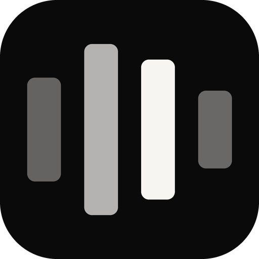

# BetterVoice brand guide

[Home](README.md) · [Getting started](GETTING_STARTED.md)

  

## The name

Write the product name as **BetterVoice**: one word, a capital B and a capital V. Use the full name on first mention, and keep the same spelling in headings, download labels, release notes, and support messages.

BetterVoice is a sibling of [BetterC0de](https://betterc0de.com). The two share a construction and a palette, not a spelling: BetterVoice is written with a regular letter o.

## The message

**Primary tagline**

> Your voice, typed anywhere.

**One-sentence description**

> BetterVoice is a Windows dictation app: press Win+O, speak, and your words appear wherever your cursor is.

**Short product introduction**

> Dictate into any app without switching windows. BetterVoice listens while you speak and types the result at your cursor — transcribed offline on your PC, or by Deepgram, ElevenLabs, or an OpenRouter model.

## The mark

The [BetterVoice mark](assets/bettervoice-mark.svg) is four upright bars on a rounded, near-black tile: a voice level. It is built exactly like the BetterC0de icon, whose four bars lie down as lines of code.

| Property | Value, in a 100 × 100 box |
| --- | --- |
| Tile | Near black, corner radius 22 |
| Bars | 13 wide on a 22 pitch, corner radius 3, centered vertically |
| Bar heights, left to right | 40, 66, 54, 30 |
| Bar color | Warm white at 38 %, 72 %, 100 %, and 40 % opacity |

Preserve the square proportions, colors, and internal spacing. Leave clear space around the tile and keep text outside it. Next to the name, use the mark at the height of the name's capital letters or larger.

The mark is defined once, in [`src/bettervoice/brand.py`](src/bettervoice/brand.py). [`scripts/generate_brand_assets.py`](scripts/generate_brand_assets.py) renders every asset from it: the SVG master, the 512 px PNG, and the app icon. Small icon sizes are drawn on the pixel grid rather than scaled down, so the bars stay sharp at 16 px.

## Visual direction

Keep the presentation calm, precise, and focused on the words. Use a dark base, warm white, and restrained grays taken from the mark.

| Color | Value | Suggested use |
| --- | --- | --- |
| Near black | #0A0A0A | Dark surfaces, the tile, the overlay pill. |
| Warm white | #F7F5F2 | Primary text, primary buttons, the tallest bar. |
| Light gray | #B5B5B5 | Secondary elements (warm white at 72 % on near black). |
| Mid gray | #666666 | Supporting details (warm white at 38 % on near black). |

The app uses Segoe UI Variable for text and Segoe Fluent Icons for symbols, both part of Windows 11. Recording is the only place with a signal color: a small red dot in the overlay.

## Voice

Be direct, helpful, and specific. Prefer concrete words such as **press**, **speak**, **choose**, and **paste**. Describe engines, languages, and speed accurately; say which numbers were measured and on what hardware. Avoid promising perfect transcripts, support for every application, or offline use for the cloud engines.

## Links and labels

| Label | Destination |
| --- | --- |
| Download BetterVoice | [GitHub Releases](https://github.com/kerim0x1/bettervoice/releases) |
| Report a problem | [GitHub Issues](https://github.com/kerim0x1/bettervoice/issues) |
| Source code | [github.com/kerim0x1/bettervoice](https://github.com/kerim0x1/bettervoice) |
| From the same maker | [BetterC0de](https://betterc0de.com) |
