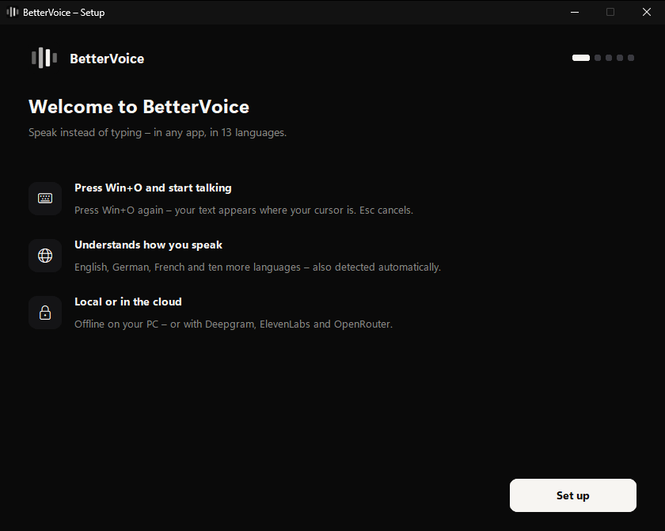
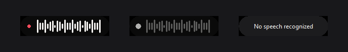
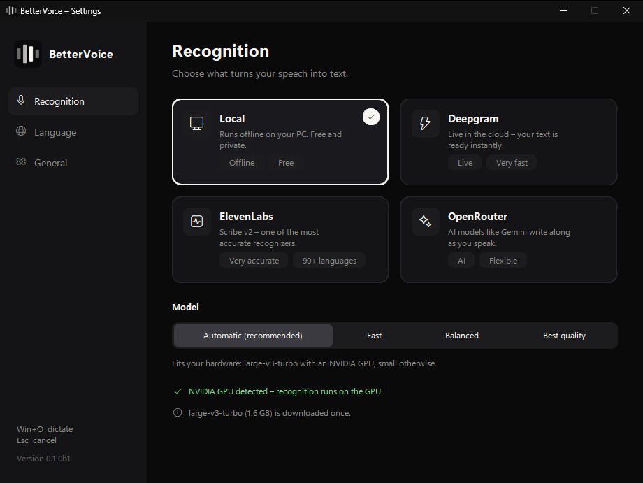

# Getting started with BetterVoice

[Home](README.md) · [How BetterVoice works](PRODUCT_GUIDE.md)

Get from download to your first dictation in a few minutes. This guide covers the app itself; to run BetterVoice from source, see [INSTALL.md](INSTALL.md).

## 1. Get the app

Download BetterVoice for your system from the newest release on the [GitHub Releases page](https://github.com/kerim0x1/bettervoice/releases). BetterVoice is not code-signed yet, so each system asks once whether you trust it.

### Windows 10 and 11

| Your PC | File |
| --- | --- |
| Windows, 64-bit | `BetterVoice-<version>-win-x64-setup.exe` |
| … with an NVIDIA graphics card, for faster offline recognition | `BetterVoice-<version>-win-x64-cuda-setup.exe` |

Run it and follow the installer. It installs BetterVoice for your Windows account, without administrator rights, and adds it to the Start menu. If SmartScreen warns about an unrecognized app, choose *More info → Run anyway*.

Prefer not to install? The release also has zip archives (`…-win-x64.zip` and `…-win-x64-cuda.zip`): unzip one to a folder you keep, for example `Documents\BetterVoice`, and start `BetterVoice.exe`.

Using an older version called **BetterTalk**? Quit it first from its tray icon. BetterVoice takes over its settings and downloaded models automatically.

### macOS 12 and newer

| Your Mac | File |
| --- | --- |
| Apple silicon (M1 and newer) | `BetterVoice-<version>-macos-arm64.dmg` |
| Intel processor | `BetterVoice-<version>-macos-x64.dmg` |

Open the disk image and drag **BetterVoice** into **Applications**. The first time, open it with a right-click on the app and **Open**; if macOS still refuses, allow it under *System Settings → Privacy & Security* with **Open Anyway**.

BetterVoice lives in the menu bar and has no Dock icon. The setup asks for the **Accessibility** permission, which it needs to hear its hotkey and to type your text; macOS asks for the microphone the first time you dictate.

### Linux

Download `BetterVoice-<version>-linux-x64.tar.gz`, unpack it to a folder you keep, and add BetterVoice to your app menu:

```sh
tar -xzf BetterVoice-<version>-linux-x64.tar.gz -C ~/Apps
~/Apps/BetterVoice/install.sh
```

BetterVoice records through PortAudio; `install.sh` tells you if it's missing (`sudo apt install libportaudio2` on Debian and Ubuntu, `sudo dnf install portaudio` on Fedora).

- **X11:** the hotkey <kbd>Ctrl</kbd>+<kbd>Alt</kbd>+<kbd>O</kbd> works right away.
- **Wayland** (the default on current Ubuntu and Fedora) doesn't let apps listen for keys themselves. The setup shows a command for a keyboard shortcut in your desktop's settings; on GNOME it adds <kbd>Ctrl</kbd>+<kbd>Alt</kbd>+<kbd>O</kbd> for you with one click. BetterVoice types into X11 apps directly and into Wayland apps with [wtype](https://github.com/atx/wtype) or [ydotool](https://github.com/ReimuNotMoe/ydotool) when installed; otherwise the text waits on the clipboard for <kbd>Ctrl</kbd>+<kbd>V</kbd>.
- **The tray icon** needs a system tray. GNOME shows it with the *AppIndicator and KStatusNotifierItem Support* extension (included in Ubuntu). Without a tray, start BetterVoice from the app menu again to open its settings.

## 2. Set it up

The setup opens on the first start and takes five or six short steps.



1. **Welcome** — an overview. Choose **Set up**.
2. **How should BetterVoice listen?** — pick an engine:

   | Engine | Choose it when | Needs |
   | --- | --- | --- |
   | **Local** | You want privacy, no costs, and work offline. | A one-time model download |
   | **Deepgram** | You want the fastest results; text is ready as you stop. | A Deepgram API key |
   | **ElevenLabs** | You want top accuracy, also for less common languages. | An ElevenLabs API key |
   | **OpenRouter** | You already use OpenRouter, or want to pick an AI model yourself. | An OpenRouter API key |

3. **Connect** your engine — for a cloud engine, paste your API key and choose **Verify**. BetterVoice checks it with the provider and saves it only on this computer. The link above the field opens the page where you create a key.
   For **Local**, choose a model; **Automatic** picks the best one for your hardware. **Download & continue** starts the one-time download, which continues in the background while you finish the setup.
4. **Which language do you speak?** — choose your language, or **Automatic** to let BetterVoice detect it.
5. **Keyboard access** (macOS, and Linux under Wayland) — allow BetterVoice under *Accessibility* on a Mac, or set up the shortcut under Wayland. The step shows when it's done.
6. **You're all set** — leave **Start with Windows** (on a Mac: **Open at login**, on Linux: **Start at login**) on to have BetterVoice ready after every sign-in, then choose **Get started**.

BetterVoice now runs in the background: in the notification area of the Windows taskbar (open the arrow next to the clock if you don't see it), in the menu bar of your Mac, or in the system tray on Linux.

## 3. Dictate

1. Click into any text field: a document, an email, a chat, the browser's address bar.
2. Press the hotkey — <kbd>Win</kbd>+<kbd>O</kbd> on Windows, <kbd>⌃ Control</kbd>+<kbd>⌥ Option</kbd>+<kbd>O</kbd> on a Mac, <kbd>Ctrl</kbd>+<kbd>Alt</kbd>+<kbd>O</kbd> on Linux. A small pill appears next to your cursor with a red dot and a moving waveform.
3. Speak naturally. Pauses are fine.
4. Press the hotkey again. The waveform dims while the last words are transcribed, then your text is pasted at the cursor.

Press <kbd>Esc</kbd> while the pill is visible to cancel; nothing is pasted.



## 4. Change settings

**Right-click the tray icon** (on a Mac: click the menu bar icon) for quick changes:

- **Recognition** — switch the engine.
- **Language** — switch the language.
- **AI Polish** — remove filler words and slips from your text (needs an OpenRouter key).
- **Settings…** — the settings window, also opened by clicking the icon on Windows.

In the settings window, **Recognition** holds the engines, keys, and the offline model; **Language** the languages; **General** AI Polish, starting at sign-in, keyboard access, help, and **Quit**. Changes are saved right away.



## 5. Update or uninstall

**To update** on Windows, download the newest installer from the [Releases page](https://github.com/kerim0x1/bettervoice/releases) and run it. It installs over your current version; settings, keys, and models stay. If BetterVoice is running, the installer asks you to quit it first from its tray icon. On a Mac, quit BetterVoice from the menu bar icon and replace the app in Applications; on Linux, quit it and unpack the new version over the old folder. With the zip archive, quit BetterVoice and replace its folder.

**To uninstall** on Windows, open *Windows Settings → Apps → Installed apps*, find **BetterVoice**, and choose **Uninstall**. The uninstaller asks whether to delete your settings, API keys, and downloaded models too; keep them if you plan to come back. On a Mac, turn off **Open at login**, quit BetterVoice, and move the app to the Trash. On Linux, turn off **Start at login**, run `./install.sh --uninstall`, and delete the folder. [How BetterVoice works](PRODUCT_GUIDE.md#privacy-and-data) lists where settings and models are, if you want those gone too.

## When something does not work

| What you see | What to check |
| --- | --- |
| Nothing happens on the hotkey | Check that the BetterVoice icon is in the tray or menu bar. Windows doesn't let apps type into programs that run as administrator unless BetterVoice runs as administrator too. On a Mac, allow BetterVoice under *System Settings → Privacy & Security → Accessibility*. Under Wayland, set up the shortcut in **Settings… → General**. |
| "BetterVoice is already running" | BetterVoice, or the older BetterTalk, is already running. Quit it from its tray icon and start BetterVoice again. On a Mac and on Linux, starting it again opens its settings instead. |
| "No microphone found" | Connect a microphone and allow microphone access: *Windows Settings → Privacy & security → Microphone*, or on a Mac *System Settings → Privacy & Security → Microphone*. |
| "Install PortAudio (libportaudio2) to record" | Linux only: install PortAudio with your package manager, then start BetterVoice again. |
| "Copied – press Ctrl+V to paste" | Linux under Wayland: BetterVoice can't type into Wayland apps without wtype or ydotool. Paste it yourself, or install one of them. On a Mac, "Copied – press ⌘V" means the Accessibility permission is missing. |
| "…: invalid API key" | Open **Settings… → Recognition**, paste the key again, and choose **Verify**. |
| "…: out of credit" or "…: rate limited" | Your account with that provider is out of credit or has hit a limit. Top up, wait a moment, or switch the engine. |
| "No speech recognized" | BetterVoice heard no speech. Speak a little louder or closer to the microphone, and check the microphone selected in your system's sound settings. |
| The pill shows "Local model downloading…" | The offline model is still downloading or loading. Your dictation is kept and typed once it is ready; <kbd>Esc</kbd> cancels. |
| The offline engine uses the processor although you have an NVIDIA GPU | Windows: install the CUDA edition (`…-cuda-setup.exe`) over your installation; your settings stay. Linux: install CUDA 12's cuBLAS and cuDNN 9. **Settings… → Recognition → Local** shows which one is used. |
| The text lands in the wrong place | BetterVoice pastes into the window that has focus when you stop. Keep the cursor in the field until the text appears. |

## Send useful feedback

Report problems on [GitHub Issues](https://github.com/kerim0x1/bettervoice/issues). Describe what you did, what you expected, and what happened, and name the engine and your system (for Linux: the desktop, and X11 or Wayland).

A log can help: **Settings… → General → Open log**. It contains status messages only — never what you dictated — but review it before posting and remove anything you don't want to share. API keys never appear in it.
