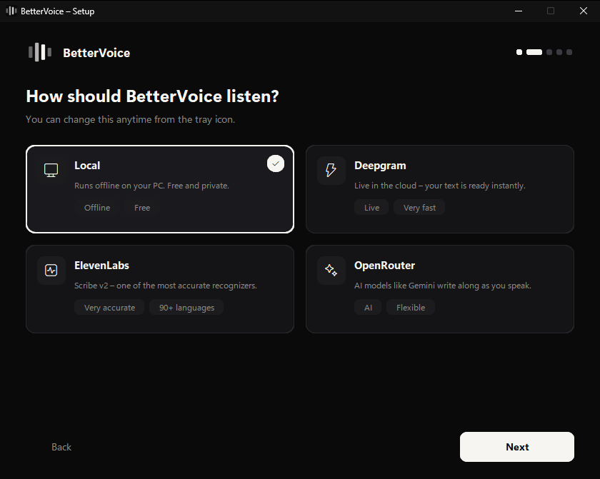

  

<h1 align="center">BetterVoice</h1>

<strong>Your voice, typed anywhere.</strong>

> [!WARNING]
> **Beta software:** BetterVoice 0.1 is an early beta for Windows 10 and 11, macOS 12 and newer, and Linux. macOS and Linux support is the newest part and less tried than Windows. Expect rough edges, and report problems through [GitHub Issues](https://github.com/kerim0x1/bettervoice/issues).

  Press the hotkey, speak, press it again — your words appear wherever your cursor is. 
  On Windows, macOS and Linux. Transcribed on your own computer, or by the cloud engine you choose.

  <a href="#download">Download</a> ·
  <a href="GETTING_STARTED.md">Getting started</a> ·
  <a href="PRODUCT_GUIDE.md">How it works</a> ·
  <a href="https://github.com/kerim0x1/bettervoice/issues">Issues</a>

---

## Meet BetterVoice

**BetterVoice is a dictation app for Windows, macOS and Linux.** It works in every program that accepts text: your editor, your browser, your chat, your mail. There is no window to switch to and nothing to copy — BetterVoice listens while you speak and types the result where you were already working.

Pick how your speech is recognized. Keep everything on your computer with the built-in offline model, or connect a cloud engine for live results and extra accuracy.

## Four ways to listen

| Engine | How it works | You need |
| --- | --- | --- |
| **Local** | OpenAI's Whisper runs on your computer, fully offline after a one-time model download. Uses your NVIDIA graphics card when there is one (Windows and Linux). | Nothing |
| **Deepgram** | nova-3 transcribes while you speak, so the text is ready the moment you stop. | A [Deepgram](https://console.deepgram.com/) API key |
| **ElevenLabs** | Scribe v2, one of the most accurate recognizers available, in 90+ languages. | An [ElevenLabs](https://elevenlabs.io/app/settings/api-keys) API key |
| **OpenRouter** | An audio-capable AI model such as Gemini Flash listens and writes along. One key, many models. | An [OpenRouter](https://openrouter.ai/settings/keys) API key |

## Built for everyday dictation

- **Works everywhere.** Dictate into any text field; BetterVoice pastes at your cursor and puts your clipboard text back afterwards.
- **Speaks your language.** English, German, French, Spanish, Italian, Portuguese, Dutch, Polish, Turkish, Russian, Chinese, Japanese and Arabic — or let BetterVoice detect the language as you go.
- **Always in view.** A small pill next to your cursor shows that BetterVoice is listening, working, or needs your attention. <kbd>Esc</kbd> cancels at any time.
- **Fast by design.** Everything up to your last pause is transcribed while you are still talking. On an NVIDIA GPU the offline engine is typically done 0.1–0.4 s after you stop.
- **Private when you want it.** With the offline engine, audio never leaves your computer. BetterVoice never writes what you dictate to its logs.
- **Polished on request.** The optional *AI Polish* removes filler words like "um" and "uh" and small slips from any engine's result.
- **Set up in a minute.** A short first-start setup walks you through engine, key or model download, and language. Everything can be changed later from the tray or menu bar icon.

## On your system

| | Windows 10 and 11 | macOS 12 and newer | Linux |
| --- | --- | --- | --- |
| Hotkey | <kbd>Win</kbd>+<kbd>O</kbd> | <kbd>⌃ Control</kbd>+<kbd>⌥ Option</kbd>+<kbd>O</kbd> | <kbd>Ctrl</kbd>+<kbd>Alt</kbd>+<kbd>O</kbd>; under Wayland through a desktop shortcut, which BetterVoice sets up on GNOME |
| Cancel | <kbd>Esc</kbd> | <kbd>Esc</kbd> | <kbd>Esc</kbd> in X11 apps |
| Where it lives | Notification area of the taskbar | Menu bar | System tray (GNOME: with the AppIndicator extension) |
| Needs | Nothing | The Accessibility permission, which the setup asks for | PortAudio (`libportaudio2`) |
| Offline engine on a GPU | NVIDIA (CUDA edition) | — (the processor) | NVIDIA, with CUDA 12's cuBLAS and cuDNN 9 |

## Download

BetterVoice is free and open source. Download it from the [GitHub Releases page](https://github.com/kerim0x1/bettervoice/releases): the newest release lists its files under **Assets**.

| System | File | Choose it for |
| --- | --- | --- |
| Windows | `BetterVoice-<version>-win-x64-setup.exe` | **Most PCs.** Installs BetterVoice for your Windows account; no administrator rights needed. |
| Windows | `BetterVoice-<version>-win-x64-cuda-setup.exe` | PCs with an NVIDIA graphics card: the offline engine runs on the GPU. A larger download. |
| Windows | `BetterVoice-<version>-win-x64.zip` and `…-cuda.zip` | Using BetterVoice without installing it: unzip, then start `BetterVoice.exe`. |
| macOS | `BetterVoice-<version>-macos-arm64.dmg` | Macs with Apple silicon (M1 and newer). |
| macOS | `BetterVoice-<version>-macos-x64.dmg` | Macs with an Intel processor. |
| Linux | `BetterVoice-<version>-linux-x64.tar.gz` | 64-bit Linux with X11 or Wayland: unpack, then run `./install.sh` for the app menu. |

Every engine works with every file. BetterVoice is not code-signed yet: on Windows, if SmartScreen warns about an unrecognized app, choose *More info → Run anyway*; on a Mac, open it the first time with a right-click and *Open*. The [getting-started guide](GETTING_STARTED.md#1-get-the-app) has the details for each system.

## Start here

1. [Download](#download) BetterVoice for your system and install it.
2. Start BetterVoice. The setup opens on the first start.
3. Choose an engine, then enter its key or download the offline model.
4. Click into any text field, press the hotkey, speak, and press it again.

The [getting-started guide](GETTING_STARTED.md) walks through each step.

## Explore the guides

| Guide | What you will find |
| --- | --- |
| [Getting started](GETTING_STARTED.md) | Installation, the setup, your first dictation, and troubleshooting. |
| [How BetterVoice works](PRODUCT_GUIDE.md) | Engines, languages, offline models, speed, and where your data goes. |
| [Brand guide](BRAND.md) | The name, the mark, colors, and reusable product descriptions. |

## Build and contribute

BetterVoice is written in Python. Start with the [installation and setup guide](INSTALL.md), then use the [development guide](docs/development/README.md) for tests, builds, and releases, and the [architecture overview](docs/architecture/overview.md) to find your way around the code. Read [Contributing](CONTRIBUTING.md), [Security](SECURITY.md), and the [third-party notices](THIRD_PARTY_NOTICES.md) before submitting changes or distributing a build.

BetterVoice is released under the [MIT License](LICENSE). Third-party components keep their own terms.

## Stay connected

Report bugs and suggest features through [GitHub Issues](https://github.com/kerim0x1/bettervoice/issues). Speech sent to a cloud engine is processed under that provider's terms; the [product guide](PRODUCT_GUIDE.md#privacy-and-data) explains what goes where.

---

<strong>BetterVoice</strong> Your voice, typed anywhere. Beta · Windows, macOS &amp; Linux · MIT License · Built by <a href="https://kerim0x1.com">kerim0x1</a> · Also from the maker: <a href="https://betterc0de.com">BetterC0de</a>

